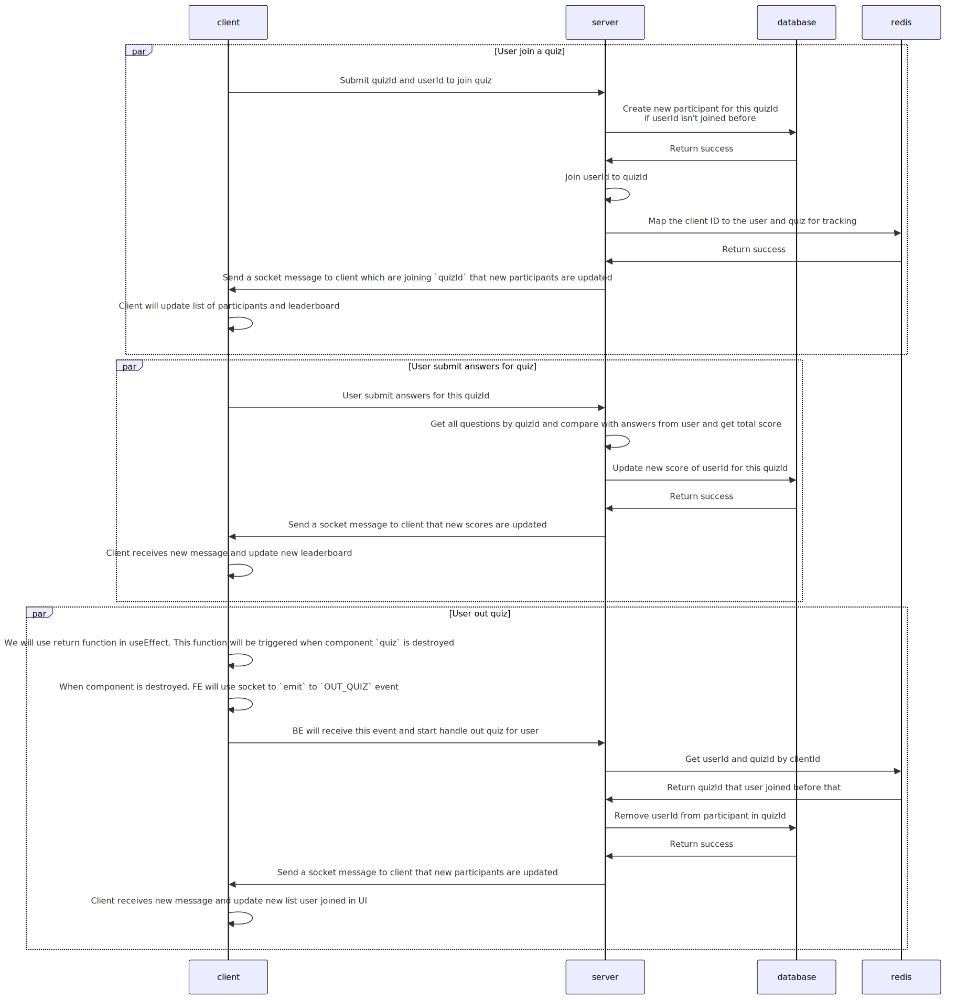

# Run backend

Change directory: `cd real-time-quiz-backend/`

Install dependencies: `npm install`

Start mongo and redis: `docker-compose up --build -d`

To seeding sample data: `npm run start:seed`

Start: `npm run start:dev`

Your application will be started in `http://localhost:3000`

# Run frontend

Change directory: `cd real-time-quiz-frontend/`

Install dependencies: `npm install`

Start: `npm run def`

Your application will be started in `http://localhost:5173/`

# System Design

https://tinyurl.com/Real-Time-Vocabulary-Quiz

# Component Description

### Backend

- `quiz`

  - `quiz.controller.ts`: Define endpoint for quiz
  - `quiz.gateway.ts`: Define socket gateway to handle event which receive/send to client
  - `quiz.interface.ts`: Interface for quiz
  - `quiz.module.ts`: Define import/provider/controller of quiz
  - `quiz.service.ts`: Define main function to handle logic for quiz
  - `quiz.schema.ts`: Define schema modal to Quiz table

- `seeder`

  - `seeder.ts`, `seeder.service.ts`, `seeder.module.ts`: Handle to seeding sample data for the first time run application

- And other files to handle logic beside that

### Frontend

- `src/_core`: Define core components which will be used and re-used in all project like button/input/table/...

  - `src/components`:

    - `join-quiz.tsx`: Form for user enters quizId and userId to join quiz
    - `leader-board.tsx`: Component to show the leaderboard
    - `question.tsx`: Show a question of quiz
    - `quiz.tsx`: This component will be rendered after user submit join quiz. It looks like a wrapper component of `leader-board/question`.

- `src/constants`: Define constant variables
- `src/interfaces`: Define interface for data
- `src/requests`: Init axios instance and define function to query data from BE
- `src/services`: Define logic and in here is fucntion to setup socket
- `src/stores`: Define store of application

- And more components to handle logic beside that

# Technologies and Tools:

### Backend

- NestJs: Framework to build a server-side application
- ioredis: Use for connect application to redis and create/add/update/delete... data in redis
- mongoose: Use for connect application mongodb and allow to query data, update/delete... in mongo
- socket.io: To open a websocket to communicate with client by event and message
- MongoDB: Use for database
- Redis: Use for caching database
- lodash: A JavaScript utility library

### Frontend

- ReactJS: Framework for web and native user interfaces
- Vite: Build tool for reactjs
- Typescript: Is javascript with syntax for types.
- axios: To query data from API
- lodash: A JavaScript utility library
- socket.io-client: to connect with socket from server, send/receive message by event type
- zustand: state management between components
